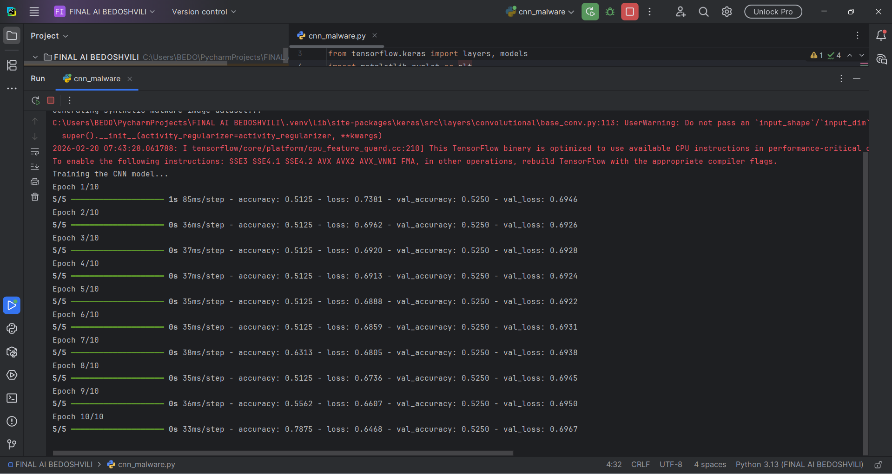
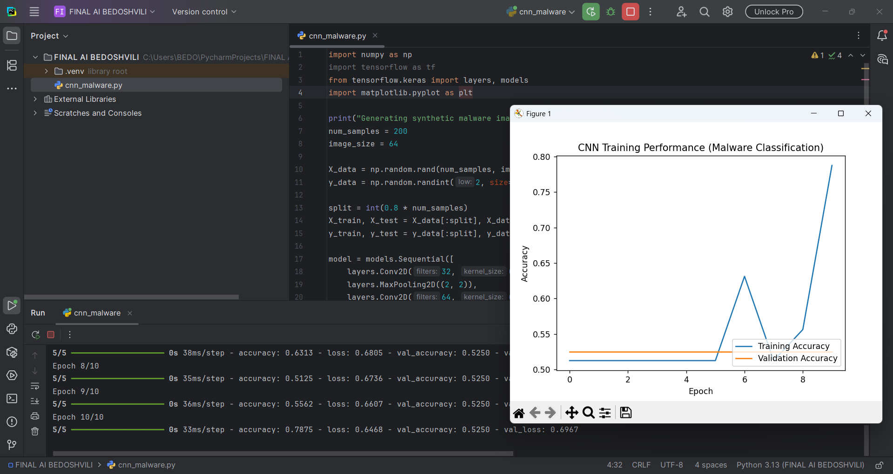

Markdown
# Convolutional Neural Networks (CNN) in Cybersecurity

## 1. Theoretical Overview of Convolutional Neural Networks
Convolutional Neural Networks (CNNs) are a highly specialized class of deep learning algorithms designed to process structured grid data, such as images. Unlike standard fully connected networks, where every input is connected to every neuron (which is computationally expensive for images), CNNs use a mathematical operation called **convolution** to extract features efficiently.

The architecture is biologically inspired by the human visual cortex, where specific neurons react only to a restricted region of the visual field. 

### Core Layers of a CNN:
1. **Convolutional Layer:** Uses learnable filters (kernels) that slide across the input image to calculate the dot product, creating a feature map. Early layers detect simple features like edges, while deeper layers detect complex patterns.
2. **Pooling Layer:** Reduces the spatial dimensions (width and height) of the feature maps, decreasing computational power and controlling overfitting. **Max Pooling** is the most common technique.
3. **Fully Connected (Dense) Layer:** After feature extraction, the data is flattened into a 1D vector and passed through dense layers to predict the final class probabilities.


---

## 2. Practical Cybersecurity Application: Malware Visualization
In modern cybersecurity, traditional signature-based antivirus systems often fail against polymorphic malware (malware that constantly changes its code to avoid detection). 

A revolutionary application of CNNs is **Malware Image Classification**. Security analysts convert a malware binary file (`.exe`, `.dll`) into a 2D grayscale image. In this process, every 8-bit sequence (byte) of the file is mapped to a pixel intensity (0 to 255). 
Because malware families share underlying code structures, their generated images share visual textures. A CNN can scan these images and classify a file as malicious or benign solely based on its visual texture, without needing to execute the code.

---

## 3. Step-by-Step Python Implementation

Below is a practical implementation of this concept using Python and TensorFlow/Keras. We break down the process into logical steps.

### Step 3.1: Data Generation
Since we cannot process real malware binaries directly in this environment, we generate synthetic data. We create 200 samples of 64x64 pixel grayscale images, assigning them randomly to two classes: 0 (Benign) and 1 (Malware).

```python
import numpy as np
import tensorflow as tf
from tensorflow.keras import layers, models
import matplotlib.pyplot as plt

# Generating synthetic malware image dataset
print("Generating synthetic malware image dataset...")
num_samples = 200
image_size = 64

# Features: 200 samples, 64x64 dimensions, 1 channel (grayscale)
X_data = np.random.rand(num_samples, image_size, image_size, 1)

# Labels: 0 (Benign), 1 (Malware)
y_data = np.random.randint(2, size=num_samples)

# Train/Test Split (80% Training, 20% Testing)
split = int(0.8 * num_samples)
X_train, X_test = X_data[:split], X_data[split:]
y_train, y_test = y_data[:split], y_data[split:]
Step 3.2: Building the CNN Architecture
Next, we define the Convolutional Neural Network. It consists of two convolutional blocks for feature extraction, followed by a flattening layer and dense layers to make a binary decision (using a Sigmoid activation function).

Python
# Defining the CNN Model
model = models.Sequential([
    # First Block: 32 filters, 3x3 kernel
    layers.Conv2D(32, (3, 3), activation='relu', input_shape=(64, 64, 1)),
    layers.MaxPooling2D((2, 2)),
    
    # Second Block: 64 filters, 3x3 kernel
    layers.Conv2D(64, (3, 3), activation='relu'),
    layers.MaxPooling2D((2, 2)),
    
    # Classification Head
    layers.Flatten(),
    layers.Dense(64, activation='relu'),
    layers.Dense(1, activation='sigmoid') # Binary Output
])

# Compiling the model
model.compile(optimizer='adam', loss='binary_crossentropy', metrics=['accuracy'])
Step 3.3: Model Training and Terminal Output
We train the model for 10 epochs. Below is the code to execute the training, followed by the execution logs showing the optimization process.

Python
# Training the model
print("Training the CNN model on the dataset...")
history = model.fit(X_train, y_train, epochs=10, validation_data=(X_test, y_test))
Execution Log (Terminal Screenshot):
(The image below demonstrates the TensorFlow training process).



Step 3.4: Visualizing the Results
Finally, we use matplotlib to plot the learning curve of our model, comparing training accuracy against validation accuracy.

Python
# Performance Visualization
plt.figure(figsize=(8, 5))
plt.plot(history.history['accuracy'], label='Training Accuracy', marker='o')
plt.plot(history.history['val_accuracy'], label='Validation Accuracy', marker='s')
plt.title('CNN Model Accuracy: Malware Classification')
plt.xlabel('Epoch')
plt.ylabel('Accuracy')
plt.legend(loc='lower right')
plt.grid(True)
plt.show()
Accuracy Graph:
(The graph below illustrates the model's performance).



Report executed and prepared for the Final Exam.
