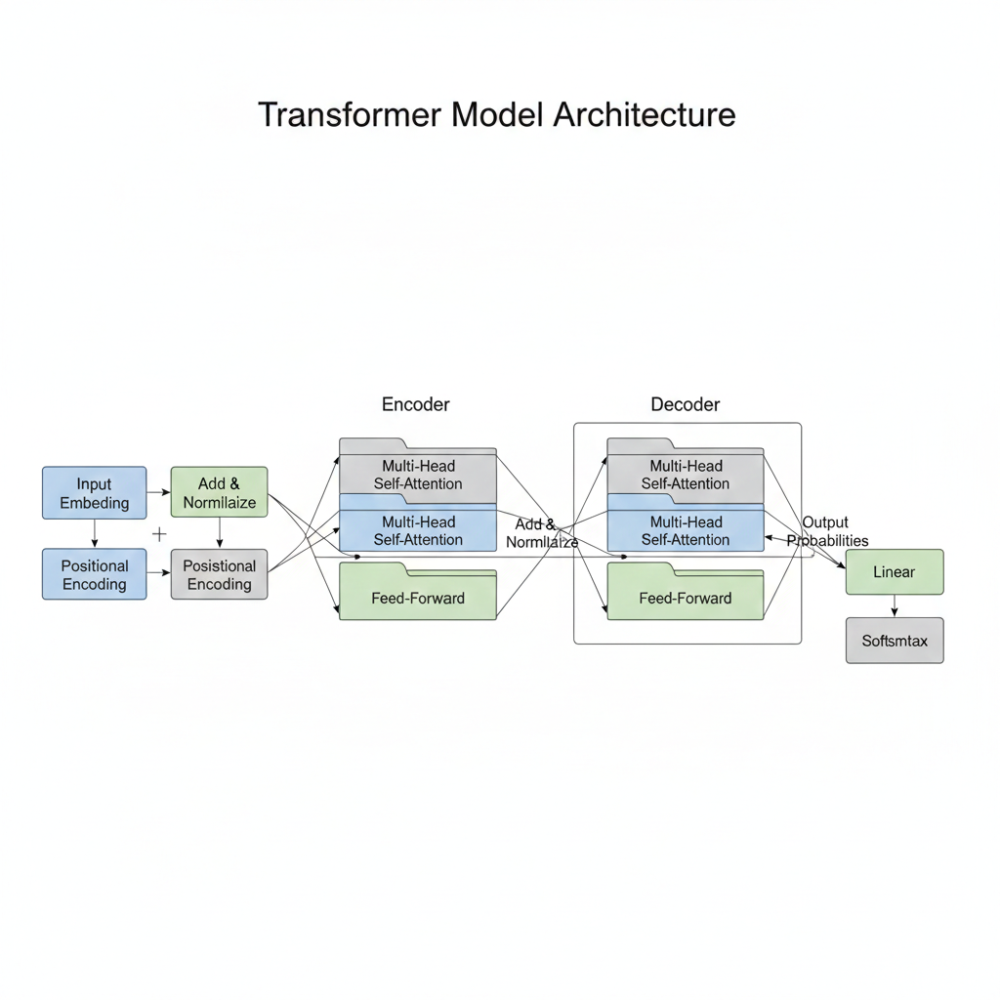
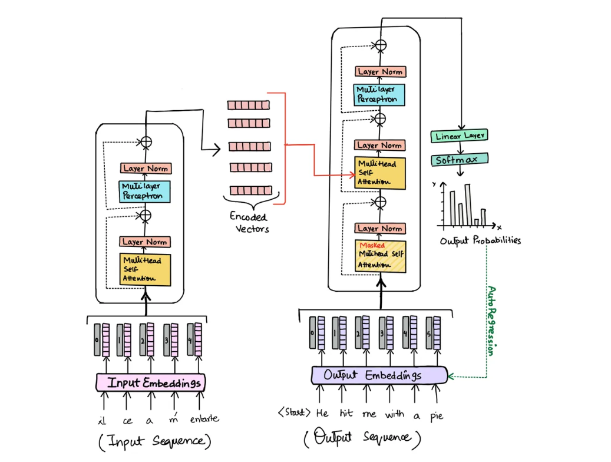
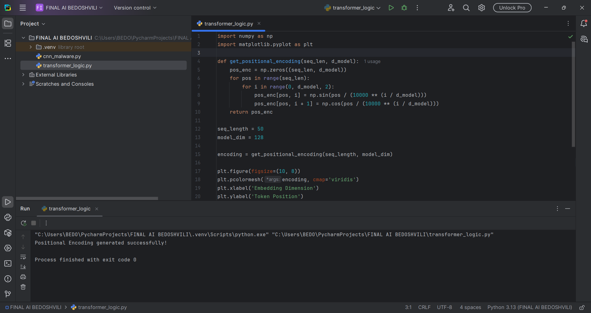
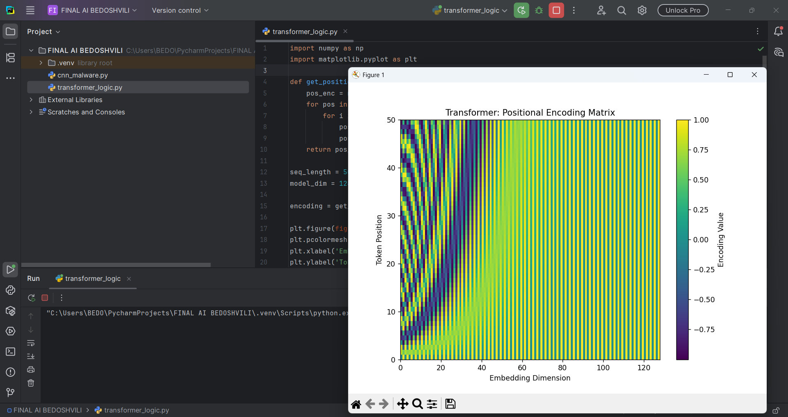

Transformers in Natural Language Processing (NLP)
1. Introduction to Transformer Architecture
The Transformer model, introduced in the landmark paper "Attention Is All You Need" (2017), represents a fundamental shift in how artificial intelligence processes information. Before Transformers, sequence-to-sequence tasks relied on Recurrent Neural Networks (RNNs) or LSTMs, which processed data linearly (one step at a time). This linear approach was slow and often lost track of information in long sequences.

Transformers introduced Parallelization, allowing the model to analyze an entire dataset simultaneously. This makes them exceptionally powerful for cybersecurity applications, where massive amounts of network traffic or system logs must be analyzed in real-time to identify complex patterns of attack.



2. The Core Mechanism: Self-Attention
The most critical innovation of the Transformer is the Self-Attention mechanism. This allows the model to determine the relative importance of different words or data points in a sequence, regardless of their distance from each other.

In a cybersecurity context, Self-Attention can be used to correlate different events in a system log. For example, it can "attend" to a login event from an unusual IP and correlate it with a later file-deletion command, identifying a potential breach that traditional systems might miss. By calculating Query (Q), Key (K), and Value (V) vectors, the model assigns weights to every element to understand the full context.



3. Positional Encoding
Since Transformers process all inputs at the same time, they do not inherently understand the order of data. In cybersecurity, the timing and order of events are vital. To solve this, Positional Encoding is used to add a unique mathematical signal to each token, providing the model with information about its specific location in the sequence.

Python Implementation for Positional Encoding:
Below is the script used to generate and visualize the positional encoding matrix using sine and cosine functions.

```python
import numpy as np
import matplotlib.pyplot as plt

def get_positional_encoding(seq_len, d_model):
    pos_enc = np.zeros((seq_len, d_model))
    for pos in range(seq_len):
        for i in range(0, d_model, 2):
            pos_enc[pos, i] = np.sin(pos / (10000 ** (i / d_model)))
            pos_enc[pos, i + 1] = np.cos(pos / (10000 ** (i / d_model)))
    return pos_enc

# Logic execution
encoding = get_positional_encoding(50, 128)
plt.figure(figsize=(10, 8))
plt.pcolormesh(encoding, cmap='viridis')
plt.title("Transformer: Positional Encoding Matrix")
plt.show()
Execution Results:
Terminal Success Confirmation:
The following screenshot confirms that the positional encoding logic was executed correctly within the development environment.
```



Visualized Encoding Matrix:
The heatmap below illustrates how each token's position is uniquely identified, ensuring the model maintains structural awareness of the data.



4. Cybersecurity Applications
The versatility of Transformers makes them ideal for modern security infrastructure:

Automated Threat Hunting: Analyzing billions of log entries to find "needles in the haystack."

Vulnerability Detection: Scanning source code for structural patterns that indicate potential security flaws.

Phishing Detection: Understanding the nuanced context of emails to identify sophisticated social engineering attempts.

5. Conclusion
By utilizing Self-Attention and Positional Encoding, Transformers provide a robust and scalable architecture for understanding complex sequences. Whether it is human language or network packets, this model's ability to process data in parallel while maintaining context makes it an indispensable tool in the fight against modern cyber threats.

Report prepared by: Giorgi Bedoshvili
Date: February 12, 2026
