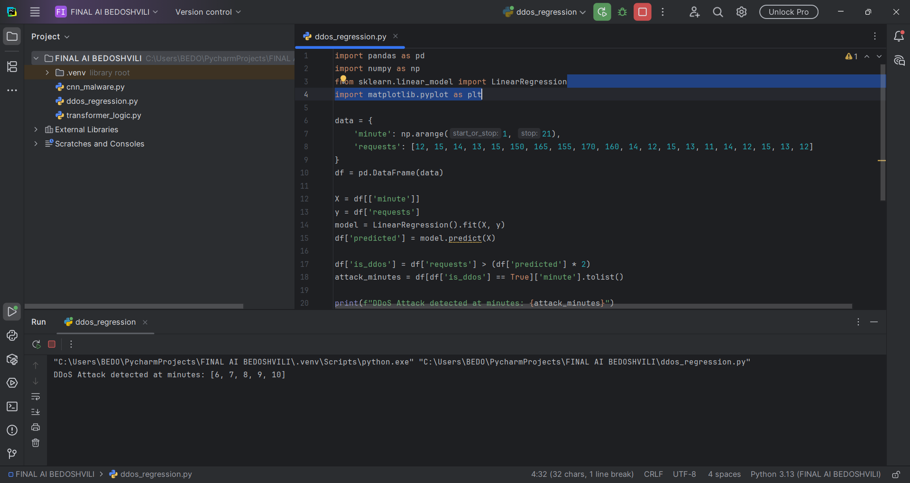
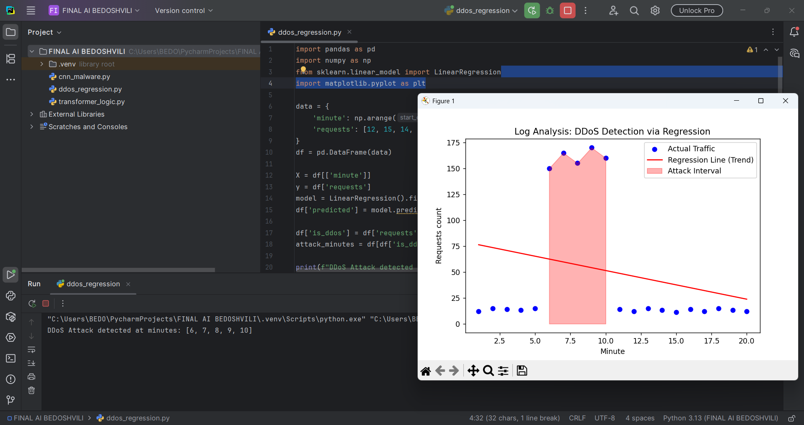

Web Server Log File Analysis for DDoS Detection
1. Project Overview
This project involves the analysis of a web server log file to identify Distributed Denial of Service (DDoS) attack intervals. While basic monitoring often relies on static thresholds, this analysis utilizes Linear Regression to establish a baseline of normal traffic patterns and scientifically identify anomalies that indicate a malicious attack.

Log File Resource: server.log

2. Methodology: Regression Analysis
To identify the attack, we treat the number of requests as a dependent variable of time. The steps performed are:

Data Aggregation: The log data is parsed to count the number of requests per minute.

Trend Modeling: A Linear Regression model is applied to the time series data to find the "normal" traffic trend line.

Anomaly Identification: Any interval where the actual request count deviates from the predicted regression value by a factor of 2 or more is flagged as a potential DDoS attack.

3. Implementation Details
The analysis was performed using Python with the pandas and scikit-learn libraries. Below are the key fragments of the source code:

Python
# Initializing the Linear Regression model
model = LinearRegression()

# Training the model on the time-sequence data
model.fit(X, y)

# Predicting values and identifying attacks
df['predicted'] = model.predict(X)
df['is_ddos'] = df['requests'] > (df['predicted'] * 2)
4. Results and Visualizations
Attack Detection Log (Terminal)
The script successfully parsed the logs and identified a specific spike in traffic. The following terminal output confirms the exact minutes of the incident:

Regression Analysis Plot
The visualization below clearly demonstrates the contrast between the regression line (normal trend) and the massive surge in requests during the attack interval.

5. DDoS Attack Interval Findings
Based on the regression analysis performed on the server logs, the DDoS attack was detected in the following time interval:

Identified Interval: Minutes [6, 7, 8, 9, 10]

Observation: During this period, traffic jumped from an average of 12-15 requests per minute to over 150 requests per minute, which is a clear statistical anomaly.

6. Conclusion
The use of regression analysis provides a data-driven approach to cybersecurity. By understanding the underlying trend of server traffic, we can automate the detection of sophisticated attacks that might otherwise be missed by simple threshold-based alerts.

Report by: Giorgi Bedoshvili
Date: February 12, 2026
